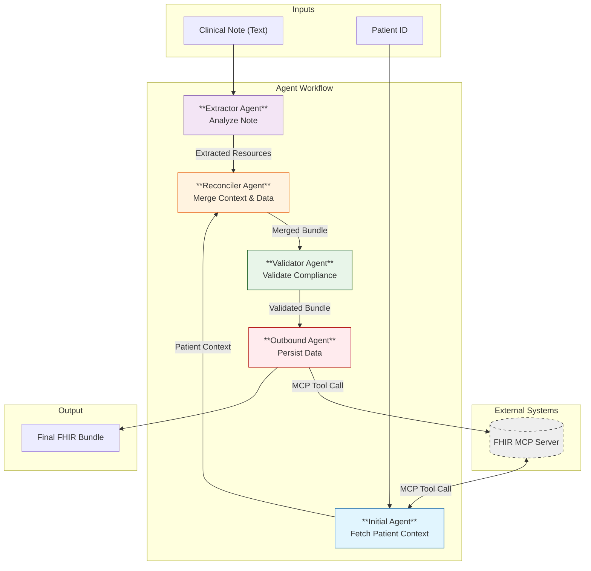

# EMR Note Agent Design & Architecture

This document outlines the architecture of the EMR Note Agent, a system designed to extract FHIR resources from clinical notes using a **5-Stage Multi-Agent Pipeline** powered by the **Model Context Protocol (MCP)**.

## Architecture Diagram

## Components

### 1. Initial Agent (Context Fetcher)
*   **Role**: Retrieval of patient context.
*   **Input**: Patient ID.
*   **Action**: Calls `get_patient_context` tool via MCP session.
*   **Output**: `Patient` resource.

### 2. Extractor Agent (Clinical Logic)
*   **Role**: Core medical concept extraction.
*   **Input**: Clinical Note text.
*   **Action**: Uses LLM to identify Entities (Conditions, Meds, Vitals) and map to FHIR resources.
*   **Output**: Unlinked/Partial FHIR Bundle.

### 3. Reconciler Agent (Data Merger)
*   **Role**: Logic & consistency.
*   **Input**: Patient Context + Extracted Resources.
*   **Action**:
    *   Injects the correct Patient ID into all resources.
    *   Resolves relative dates.
    *   Ensures implicit links are made explicit (e.g., Encounter links).
*   **Output**: A cohesive, linked FHIR Bundle.

### 4. Validator Agent (Quality Assurance)
*   **Role**: Compliance checking.
*   **Input**: Reconciled Bundle.
*   **Action**:
    *   Checks for required FHIR fields.
    *   Verifies terminology standards (ICD-10, CPT, etc.).
    *   Fixes minor structural errors.
*   **Output**: Validated FHIR Bundle.

### 5. Outbound Agent (Persistence)
*   **Role**: System interface.
*   **Input**: Validated Bundle.
*   **Action**: Calls `save_bundle` tool via MCP session.
*   **Output**: Commit status / Final JSON output.

## MCP Integration & Future Flexibility

This system is built using the **Model Context Protocol (MCP)** to abstract the FHIR server interaction.
*   **Current State**: Includes a local `fhir_mcp_server.py` using FastMCP for testing and development.
*   **Future/Production**: The `fhir_mcp_server.py` can be swapped for a production-grade MCP server, such as **WSO2's FHIR MCP Server** or any other MCP-compliant interface, without changing the agent code. The agents simply call `get_patient_context` or `save_bundle` regardless of the underlying implementation.

## Key Features

*   **Sequential Chaining**: Each agent performs a specialized task.
*   **Context Isolation**: The Extractor focuses only on text, while the Reconciler handles business logic.
*   **Protocol Agnostic**: Interacts via standard MCP tools, enabling easy integration with enterprise FHIR gateways.
