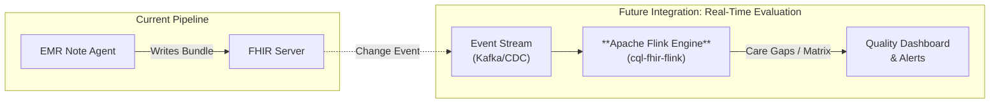

# Future Design: Real-Time Care Gap & Quality Evaluation

## Overview
This document outlines the roadmap for extending the EMR Note Agent to support **Real-Time Care Gap Discovery** and **Quality Matrix Evaluation**. By integrating with the [cql-fhir-flink](https://github.com/dhananjaydpatkar/cql-fhir-flink) engine, the system will move beyond simple data extraction to proactive clinical decision support.

## Architecture

The proposed integration introduces a real-time stream processing layer using **Apache Flink**.

## Key Components

### 1. cql-fhir-flink Integration
The [cql-fhir-flink](https://github.com/dhananjaydpatkar/cql-fhir-flink) repository provides the core engine for:
- **CQL Evaluation**: Executing Clinical Quality Language rules against incoming FHIR resources.
- **Stream Processing**: Handling high-throughput medical data in real-time.

### 2. Workflow
1.  **Extraction**: The `EMR Note Agent` extracts and persists FHIR resources (Encounters, Conditions, Procedures) to the FHIR Server.
2.  **Ingestion**: The `cql-fhir-flink` engine ingests these resources (via FHIR subscriptions or CDC streams).
3.  **Evaluation**:
    *   **Care Gaps**: Immediately identifies missing recommended screenings or interventions (e.g., "Patient needs Hba1c check").
    *   **Quality Matrix**: Computes aggregate quality scores based on HEDIS/CMS measures.
4.  **Feedback**: Results can be written back to the FHIR Server (as `MeasureReport` or `Flag` resources) or pushed to a dashboard.

## Technical Requirements
- **Apache Flink Cluster**: For running the `cql-fhir-flink` jobs.
- **CQL Definitions**: Standardized logic files for the desired quality measures.
- **FHIR Subscription/CDC**: Mechanism to trigger the Flink job upon new data entry.

## Goals
- **Proactive Care**: Move from retrospective chart review to real-time clinical insights.
- **Compliance**: Automated tracking of quality measures.
- **Closed Loop**: Potentially feeding care gaps back into the `EMR Note Agent` context for future notes.
