# Future Design: Agentic Workflow Expansion via MCP Ecosystem

The EMR Agent will evolve into an **Action-Oriented Coordinator** by integrating specialized MCP Servers for different clinical domains. Instead of just passive documentation (extraction), the agent will actively fulfill clinical intents.

## 1. Medication Cycle Management (PBM Integration)
**Scenario**: The doctor prescribes a medication or approves a refill in the note.
*   **Trigger**: Extraction of `MedicationRequest` with `intent=order` or `refill`.
*   **MCP Integration**: **PBM (Pharmacy Benefit Manager) MCP Server**.
*   **Agent Action**:
    1.  Agent identifies the medication order.
    2.  Calls PBM MCP tool: `fulfill_medication_order(medication_code, patient_id, dosage)`.
    3.  PBM Server checks formulary, processes eligibility, and routes to the pharmacy.
    4.  Agent receives confirmation and updates the `MedicationRequest` status to `active` with fulfillment details.

## 2. Diagnostics & Imaging Loop
**Scenario**: The doctor orders a lab test or X-ray (e.g., "Order CXR and CBC").
*   **Trigger**: Extraction of `ServiceRequest` or `diagnostic-order`.
*   **MCP Integration**: **Diagnostic/LIS MCP Server**.
*   **Agent Action**:
    1.  Agent extracts the order details.
    2.  Calls Diagnostic MCP tool: `place_diagnostic_order(test_code, urgency, patient_id)`.
    3.  **Results Loop**:
        *   The Diagnostic MCP Server can provide a `check_results()` tool or push updates.
        *   When results are available, the agent pulls the data and creates a `DiagnosticReport` FHIR resource automatically, attaching it to the patient record.

## 3. Care Coordination & Referral Loop
**Scenario**: The doctor wants to refer the patient to a cardiologist or schedule a follow-up in 3 months.
*   **Trigger**: Extraction of `ServiceRequest` (Referral) or Plan/Instruction text.
*   **MCP Integration**: **Scheduling & Referral MCP Server**.
*   **Agent Action**:
    *   **For Referrals**:
        1.  Calls `search_provider(specialty="Cardiology", location=zip)`.
        2.  Calls `send_referral(patient_id, provider_id, reason)` to book the referral.
    *   **For Follow-ups**:
        1.  Calls `schedule_appointment(patient_id, timeframe="3 months", type="follow-up")`.
        2.  System confirms the slot and adds it to the `Appointment` FHIR resource.

## Architecture Diagram (Expanded)

```mermaid
graph TD
    subgraph "EMR Agent Core"
        Orchestrator[Agent Orchestrator]
    end

    subgraph "MCP Ecosystem"
        FHIR_MCP[("FHIR Store MCP")]
        PBM_MCP["💊 PBM / Pharmacy MCP"]
        Diag_MCP["🔬 LIS / Diagnostic MCP"]
        Sched_MCP["📅 Scheduling MCP"]
    end

    Orchestrator <-->|"CRUD Resources"| FHIR_MCP
    Orchestrator <-->|"Order Meds"| PBM_MCP
    Orchestrator <-->|"Order Labs / Get Results"| Diag_MCP
    Orchestrator <-->|"Book Appt / Refer"| Sched_MCP
```

